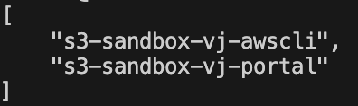
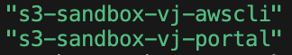

# S3 commands:

## Basic bucket commands:

### Create bucket:

```bash
aws s3api create-bucket --bucket s3-sandbox-vj-awscli --region eu-west-2 --create-bucket-configuration LocationConstraint=eu-west-2
```

Notes: `aws s3api create-bucket --bucket s3-sandbox-vj-awscli --region eu-west-2` -> This comman can give **IllegalLocationConstraintException** error because when we create a bucket in any region other than us-east-1, we need to specify the region in the create-bucket-configuration parameter. Hence, adding `--create-bucket-configuration LocationConstraint=eu-west-2` is required.

### List buckets:

```bash
aws s3api list-buckets
```

Notes: `aws s3api list-buckets --query "Buckets[?Name=='s3-sandbox-vj-awscli']"` -> To list the specific bucket.
`--query "Buckets[].Name"` to list only the bucket names like this:



We can also use `jq` to filter the output, by adding. `| jq .Buckets[].Name`. This gives a clear output with the names of the buckets like this:



### List all bucket objects:

```bash
aws s3 ls
```

Notes: `aws s3 ls s3://s3-sandbox-vj-awscli` -> To list all objects in the bucket.

### Upload file to bucket:

```bash
aws s3 cp ./file.txt s3://s3-sandbox-vj-awscli
```

Notes: If file is > 160 GB, we can upload it through CLI but not through the AWS console.
To upload a file with an expiration time: add `--expires-in 604800` to the command.

### Upload directory to bucket:

```bash
aws s3 sync ./assets s3://s3-sandbox-vj-awscli
```

Notes: Add flag `--dryrun` to check what files will be uploaded.

### Download file from bucket:

```bash
aws s3 cp s3://s3-sandbox-vj-awscli/file.txt ./downloaded_assets/file2.txt
```

Notes: You can change the file name while downloading.

### Download directory from bucket:

```bash
aws s3 sync s3://s3-sandbox-vj-awscli/assets ./downloaded_assets
```

Notes: Add flag `--dryrun` to check what files will be downloaded.

### List all the objects in the bucket:

```bash
aws s3api list-objects --bucket s3-sandbox-vj-awscli --query "Contents[]"
```

Notes: To list specific objects, use `--query "Contents[?Key=='file.txt']"`.
To list objects with a specific prefix, use `--query "Contents[?Key.startsWith('prefix/')] "`.
To just view the keys, use `--query "Contents[].Key"`.
To exclude the folder names from the result, use `--query "Contents[?Key.endsWith('/')]"`.
To exclude the files from the result, use `--query "Contents[?Key.endsWith('.txt')] "`.

### Put object in the bucket:

```bash
aws s3api put-object --bucket s3-sandbox-vj-awscli --key index.html --body ./assets/index.html
```

Notes: Difference between `cp` and `put-object`:
`cp` is a **high-level** command (S3). It is simple, user-friendly, and handles large file uploads (multipart) automatically.
`put-object` is a **low-level** command (S3API). It maps directly to the API, giving more control parameters (like ACLs, Content-Type, Cache-Control, etc.) but **doesn't handle multipart** uploads automatically.

### Delete specific file from bucket:

```bash
aws s3 rm s3://s3-sandbox-vj-awscli/file.txt
```
Notes: Can use `aws s3api delete-objects` with `--delete` parameter to delete a specific object from a bucket. You need to create a JSON format of the key to delete the object.

### Delete all objects from bucket:

```bash
aws s3 rm s3://s3-sandbox-vj-awscli --recursive
```
Notes: Can use `aws s3api delete-objects` to delete all objects from a bucket. It also provides `--delete` parameter to filter the objects to delete.

### Delete bucket:

```bash
aws s3api delete-bucket --bucket s3-sandbox-vj-awscli
```

Note: You can also use `aws s3 rb s3://s3-sandbox-vj-awscli` to delete the bucket. It may give an error **BucketNotEmpty** if the bucket is not empty.

## Additional commands:

### Get metadata of a specific object:

```bash
aws s3api head-object --bucket s3-sandbox-vj-awscli --key file.txt
```

### Enable versioning on a bucket:

```bash
aws s3api put-bucket-versioning --bucket s3-sandbox-vj-awscli --versioning-configuration Status=Enabled
```

### Disable versioning on a bucket:

```bash
aws s3api put-bucket-versioning --bucket s3-sandbox-vj-awscli --versioning-configuration Status=Disabled
```

### Upload with specific storage class:

```bash
aws s3 cp file.txt s3://s3-sandbox-vj-awscli/ --storage-class INTELLIGENT_TIERING
```

Notes: Useful for saving costs. Classes include `STANDARD` (default), `STANDARD_IA` (infrequent access), `GLACIER` (archive), and `INTELLIGENT_TIERING` (auto-moves objects based on usage).

### Upload with server-side encryption (SSE-S3):

```bash
aws s3 cp file.txt s3://s3-sandbox-vj-awscli/ --sse AES256
```

Notes: Encrypts data at rest using keys managed by S3.

### Generate a pre-signed URL:

```bash
aws s3 presign s3://s3-sandbox-vj-awscli/file.txt --expires-in 3600
```

Notes: Creates a temporary URL to share an object without making the whole bucket public. The URL expires in 3600 seconds (1 hour).

---

###### S3 CLI commands can be found [here](https://docs.aws.amazon.com/cli/latest/reference/s3/).

###### S3API CLI commands can be found [here](https://docs.aws.amazon.com/cli/latest/reference/s3api/).

## Powershell Commands

Reference: [AWS Tools for PowerShell Cmdlet Reference](https://docs.aws.amazon.com/powershell/v5/reference/)

### Create a bucket

```powershell
New-S3Bucket -BucketName s3-sandbox-vj-pwsh
```

### Upload a file to a bucket

```powershell
Write-S3Object -BucketName s3-sandbox-vj-pwsh -File ./index.html -Key index.html
```

### Check if a bucket exists

```powershell
Get-S3Bucket -BucketName s3-sandbox-vj-pwsh
```

Notes: If the bucket doesn't exist, it will throw an error. You can use `-ErrorAction SilentlyContinue` to suppress the error.

### Check if a file exists in a bucket

```powershell
Get-S3Object -BucketName s3-sandbox-vj-pwsh -Key index.html
```

Notes: If the file doesn't exist, it will throw an error. You can use `-ErrorAction SilentlyContinue` to suppress the error.

---

## Examples

### Bash Scripts Examples

Located in `s3/bash-scripts/`

Command to run the script files:
`./create-bucket <variables>`

### Powershell Examples

Located in `s3/powershell-scripts/`


### SDK Examples

#### Ruby

Located in `s3/sdk/ruby/`

**Prerequisites:**

- Ruby 2.6+
- Bundler

**Setup:**

1. Navigate to the directory: `cd s3/sdk/ruby`
2. Install dependencies: `bundle install`
   _(Note: Native extension gems like `pry` and `nokogiri` are commented out in Gemfile to support system Ruby)_
3. Ensure your `.env` file is in the project root with `AWS_ACCESS_KEY_ID`, `AWS_SECRET_ACCESS_KEY`, and `AWS_REGION`.

**Run:**

```bash
BUCKET_NAME='your-bucket-name' bundle exec ruby s3.rb
```

#### Javascript

Located in `s3/sdk/javascript/`
AWS SDK for JavaScript v3 Documentation: https://github.com/aws/aws-sdk-js-v3

**Prerequisites:**

- Node.js
- npm

**Setup:**

1. Navigate to the directory: `cd s3/sdk/javascript`
2. Install dependencies: `npm install`
3. Ensure your `.env` file is in the project root.

**Run:**

```bash
BUCKET_NAME='your-bucket-name' node s3.js
```

### CloudFormation Examples

Located in `s3/cloudformation/`
AWS s3 CloudFormation Documentation: https://docs.aws.amazon.com/AWSCloudFormation/latest/TemplateReference/aws-resource-s3-bucket.html


### Terraform Examples

Located in `s3/terraform/`

AWS s3 Terraform Documentation: https://developer.hashicorp.com/terraform/tutorials/aws-get-started

#### Terraform commands

- `terraform init` to initialize the Terraform configuration
- `terraform plan` to see the changes that will be made
- `terraform apply` to apply the changes
- `terraform destroy` to destroy the resources

### CDK Examples

Produces a CloudFormation template underneath, but it is more like a higher level abstraction. 

Located in `s3/cdk/`

AWS s3 CDK Documentation: https://github.com/aws/aws-cdk

#### Create a CDK app

```bash
 cdk init app --language=typescript
```

#### Deploy the CDK app

```bash
 cdk bootstrap
```
